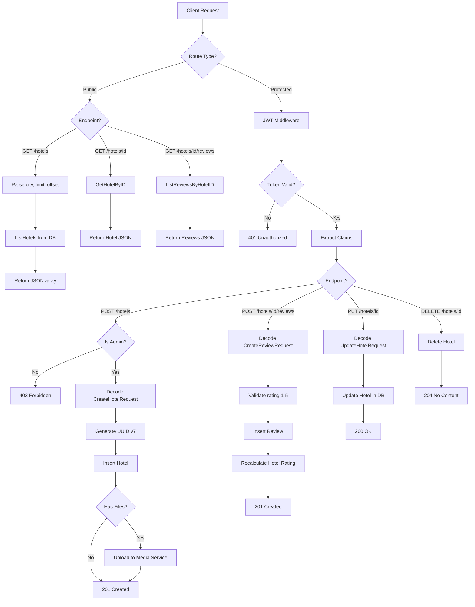
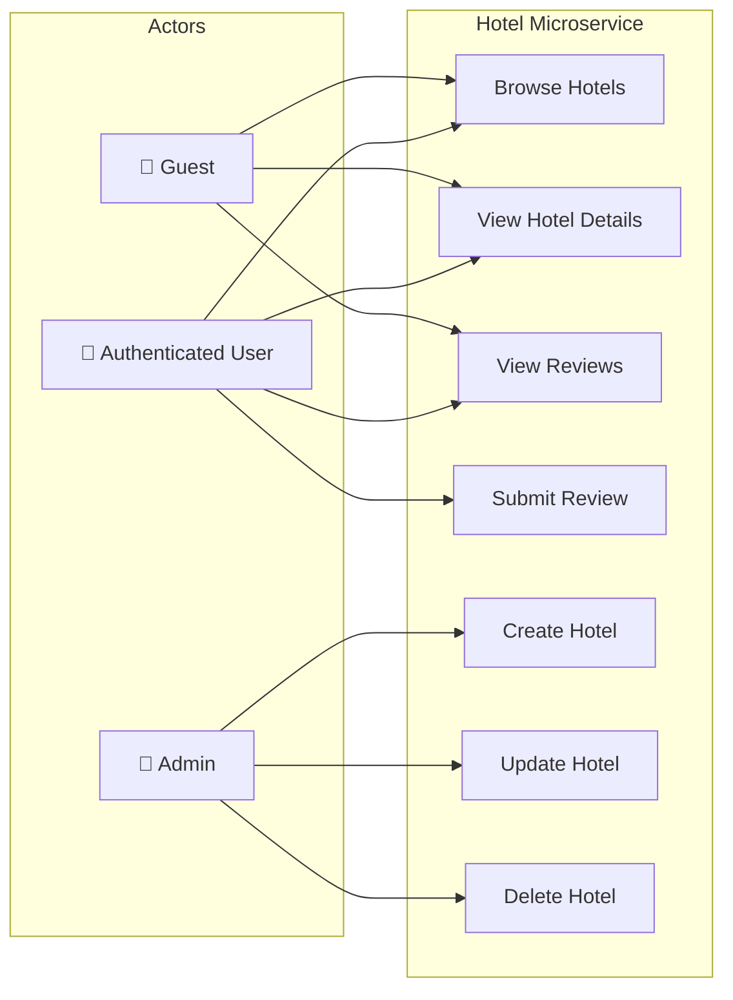
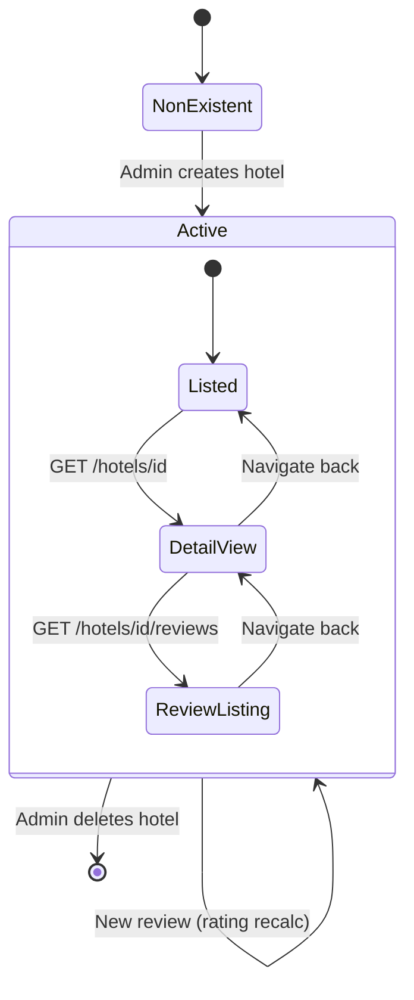
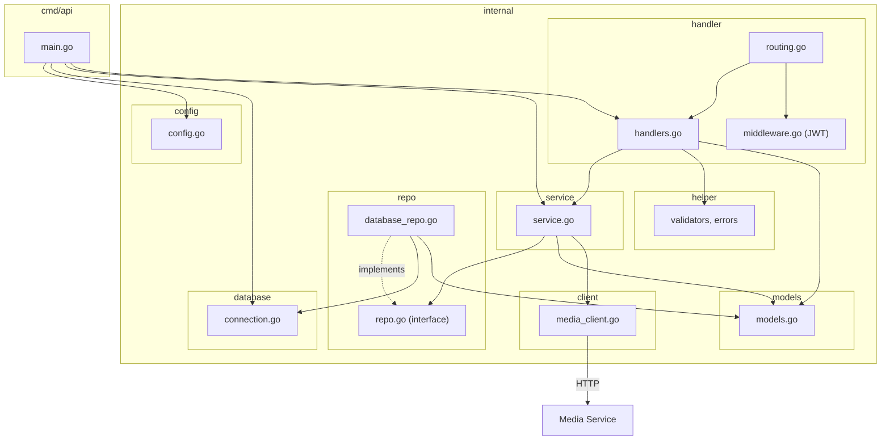

# 🏨 Hotel Microservice

> Hotel and review management service for the Hotel Reservation Platform.

## Overview

The Hotel Microservice manages **hotel entities** and their **user reviews**. It provides CRUD operations for hotels (restricted to admin users), public listing/search capabilities, and a review system that automatically recalculates hotel ratings. It also integrates with the Media Service for hotel image uploads.

## Tech Stack

| Layer | Technology |
|---|---|
| Language | Go 1.25 |
| Router | [go-chi/chi](https://github.com/go-chi/chi) v5 |
| Database | PostgreSQL 16 |
| DB Driver | [pgx](https://github.com/jackc/pgx) v5 |
| Auth | JWT verification (RSA-256 public key) |
| UUID | Google UUID v7 (time-sortable) |
| Container | Docker (multi-stage Alpine build) |

## Architecture

```
app/
├── cmd/api/          # Application entrypoint
│   └── main.go
├── internal/
│   ├── client/       # Media Service HTTP client
│   ├── config/       # YAML config loader
│   ├── database/     # PostgreSQL connection pool
│   ├── handler/      # HTTP handlers, routing, JWT middleware
│   ├── helper/       # Validators, error types, response helpers
│   ├── logging/      # Structured slog logger
│   ├── models/       # Domain entities (Hotel, Review, DTOs)
│   ├── repo/         # Repository interface + PostgreSQL implementation
│   └── service/      # Business logic (CRUD + rating recalculation)
├── sql/
│   └── migrations/   # SQL migrations
├── config.yaml
├── Dockerfile
└── go.mod
```

## API Endpoints

### Public Routes (No Authentication)

| Method | Path | Description |
|---|---|---|
| `GET` | `/health` | Liveness probe |
| `GET` | `/ready` | Readiness probe |
| `GET` | `/hotels` | List hotels (filter by `?city=`) |
| `GET` | `/hotels/{id}` | Get hotel by ID |
| `GET` | `/hotels/{id}/reviews` | List reviews for a hotel |

### Protected Routes (JWT Required)

| Method | Path | Role | Description |
|---|---|---|---|
| `POST` | `/hotels` | Admin | Create a new hotel |
| `PUT` | `/hotels/{id}` | Admin | Update hotel details |
| `DELETE` | `/hotels/{id}` | Admin | Delete a hotel |
| `POST` | `/hotels/{id}/reviews` | User | Submit a review |

## Data Model

### `hotels` Table

| Column | Type | Description |
|---|---|---|
| `id` | UUID v7 | Primary key |
| `admin_id` | UUID | FK → Users service (admin who created) |
| `name` | VARCHAR | Hotel name |
| `city` | VARCHAR | City location |
| `description` | TEXT | Hotel description |
| `rating` | FLOAT | Average rating (auto-calculated) |
| `lat` | FLOAT | Latitude coordinate |
| `lng` | FLOAT | Longitude coordinate |
| `created_at` | TIMESTAMP | Record creation time |
| `updated_at` | TIMESTAMP | Last update time |

### `reviews` Table

| Column | Type | Description |
|---|---|---|
| `id` | UUID v7 | Primary key |
| `hotel_id` | UUID | FK → `hotels.id` |
| `user_id` | UUID | FK → Users service |
| `rating` | INT | Rating (1–5) |
| `comment` | TEXT | Review comment |
| `created_at` | TIMESTAMP | Review creation time |

## Flow Diagram



## Use Case Diagram



## State Diagram



## Package Diagram



## Configuration

```yaml
server:
  host: "0.0.0.0"
  port: 8080

logging:
  level: "info"
  format: "json"
```

### Environment Variables

| Variable | Description |
|---|---|
| `DATABASE_URL` | PostgreSQL connection string |

### Volume Mounts (Docker)

| Host Path | Container Path | Description |
|---|---|---|
| `./keys/public.pem` | `/app/keys/public.pem` | JWT verification key |

## Port Mapping

| Context | Port |
|---|---|
| Internal (container) | `8080` |
| External (host) | `8084` |
| Database (host) | `5435` → `5432` |
